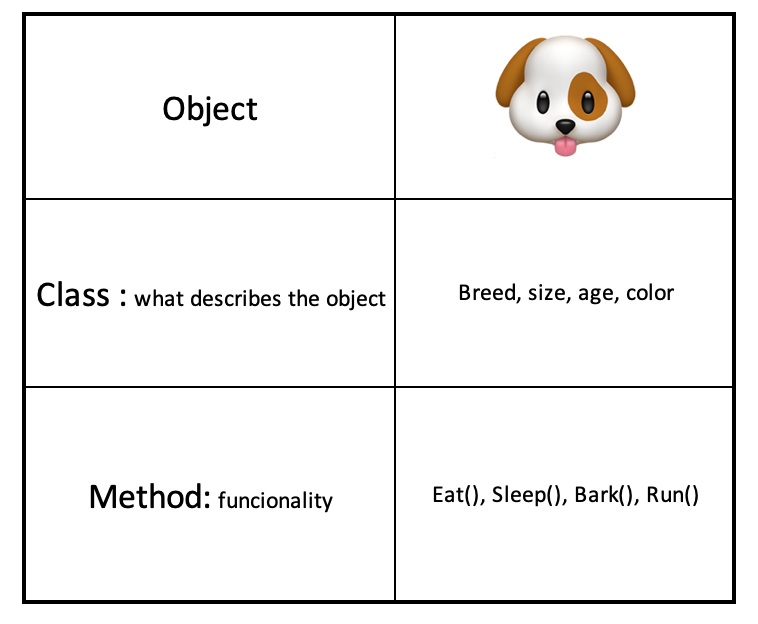

```{r setup, include=FALSE}
options(htmltools.dir.version = FALSE)
```

```{r xaringan-themer, include=FALSE}
library(xaringanthemer)
mono_accent(
 base_color = "#0F425CFF",
  black_color = "#0F425CFF",
  header_color = "#CC8214FF",
  text_bold_color = "#800000FF",
  table_row_even_background_color = "#FFFFFF",
  title_slide_text_color = "#CC8214FF",
  table_border_color = "#01665E",
  header_font_google = google_font("Chilanka"),
  text_font_google   = google_font("Lato", "400", "400i"))
```


## Welcome!

This is part 1 of the R Ladies Netherlands bookclub. 

We're reading Advanced R by Hadley Wickham.

https://adv-r.hadley.nz/


--

## The Plan
We will work through all of Advanced R together!

You can find all materials on Github:
https://github.com/rladiesnl/book_club

We are going to rotate through every 2 weeks, with an event hosted by each of the NL RLadies chapters involved.
---
class: bg-main1 split-30 hide-slide-number

.column.bg-main3[
]
.column.slide-in-right[
.sliderbox.bg-main2.vmiddle[
.font5[R6]
]]
---
class: split-two white

.column.bg-white[.content[


]]

.column.bg-main1[.content[.font2[### Object- Oriented Programming (OPP)]
.font1[
- ### Small number of well understood objects.
- ### God for building tools instead to analysing data.
- ### Functions behaves differently depends on the object.
]

--
.font2[### There are different package for OPP]
.font1[
- ### S3: Simple system good to start.
- ### S4: Bioconductor (encapsulation,inheretants).
- ### ReferenceClasses (RC).
- ### R6: Kind of RC but simple way.]
]

]


---


### R6
We keep working on the OOP (Object-Oriented Programming)
We have talked about S3 and S4, but today we will talk about R6.

object -> class-> method
object -> what describe the object->functionality

object: 20 types (logical vector,integer vector , list, environment) 

---
### When to used OOP

Small number of objects well understanding objects
Graphical user interphases
-God for building tools instead analyzing data (functional programming)
-Functions can behave differntly for different kind of objects.

---
###There are different package for OPP
There have been created 9 packages but now
-S3: Simple system good to start.
-S4: Bioconductor (encapsulation,inheretants).
-ReferenceClasses
-R6: Kind of RC but simple way

---
### Distinguish Variables
class(matrix) "matrix"
typeof(matrix) "float"

mode()
storage.mode()

override the class but not typeof()
class(X)<-"gato"
---
### Summary
function overloading= input dependent function behaviour
having different behaviours of function depending on the object
---
### S3
function split in generic and method
methods are named generic.class
print.Date
method signatures contain generaric signature
functin(x,...) elipsis argument

---
### Method
methods(class="glm") S3 and S4
.S3mehtods(class="glm")

---
### Encapsulation
separation
separating implementton fromuser interfase

apple_factory<- R6class{
  "iphonex",
  
  store data implementation
  private=list(
           capacity=64GB
           block_status=TRUE
  ),
  store methods ui
  public=list(
     unblock_cell=function{
     private$block_status=FALSE
     }
            
  )
  
  private$ to access private elemnents
  ... and self$ to access public
}


### Examples
